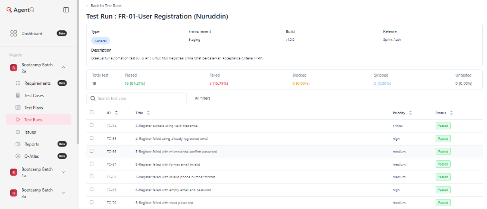
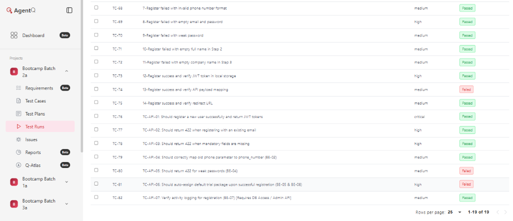
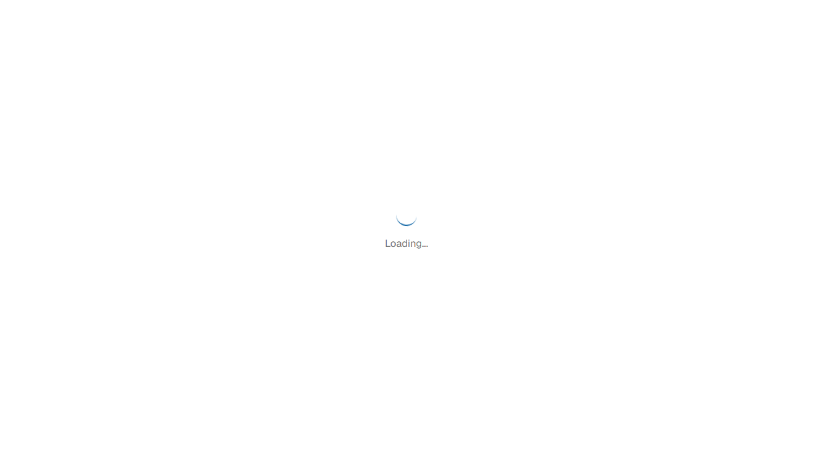
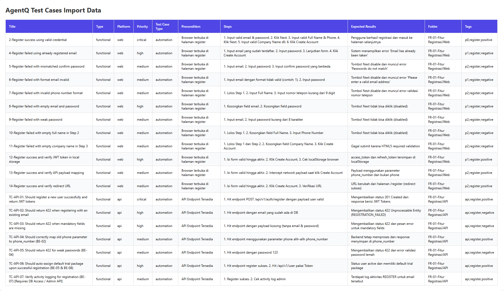

<div align="center">
  
# QA SIGN-OFF DOCUMENT
## US-01 – Registrasi via Email & Password - Nuruddin
Emra Chat – Sprint Authentication Module
28 Juli 2026

<br>

| Project | Emra Web App |
| :--- | :--- |
| **Sprint / Release** | R2026.1 |
| **User Story** | US-01 – Registrasi via Email & Password - Nuruddin |
| **Environment** | Staging |
| **Framework** | Playwright + TypeScript |
| **QA Engineer** | Nuruddin |
| **Date Prepared** | 28 Juli 2026 |
| **Version** | 1.0 |

<br>

| STATUS | SEMUA 19 TEST CASE TELAH DIEKSEKUSI – SIAP SIGN-OFF |
| :---: | :--- |

</div>

<br>

## 1. Executive Summary
Dokumen ini merupakan laporan resmi QA Sign-Off untuk User Story US-01 (Fitur Registrasi) pada aplikasi Emra Chat. Seluruh 19 test case automation telah dieksekusi melalui Playwright dan hasilnya diverifikasi menggunakan AgentQ.

Pengujian mencakup skenario fungsional (16 TC) dan integrasi API (3 TC), dengan distribusi skenario positif, negatif, dan edge case. Pengujian dilakukan sepenuhnya menggunakan *automation* pada platform Web dan API.

### Scope of Testing
**Automation Testing (In Scope):**
- *Regression test suite* mencakup *positive data inputs*, *boundary rules*, dan pengecekan validasi form registrasi.
- *Endpoint integration testing*, validasi *response status code*, dan *backend error-handling verification*.

**Out Of Scope:**
- Fitur *Forgot Password/Reset Password*.
- Pengujian *Load* dan *Performance*.
- Pengujian eksploratori manual (seluruh 19 kasus uji ini 100% *automated*).

---

## 2. Test Execution Summary

| Metric | Total | Critical | High | Others |
| :--- | :---: | :---: | :---: | :---: |
| **Test Cases** | **19** | 2 | 11 | 6 |
| **Execution Type** | Manual: 0 | Auto: 19 | 100% auto | |
| **Test Type** | Func: 16 | Integ: 3 | Sec: 0 | |
| **Scenario Coverage** | Positive: 6 | Negative: 11 | Edge: 2 | |

---

## 3. Detail Test Cases
US-01 — Register | Total: 19 TC | Manual: 0 | Automation: 19

| No | Title | Type | Platform | Priority | Exec | Tag | Result |
| :---: | :--- | :---: | :---: | :---: | :---: | :---: | :---: |
| 1 | Register success using valid credential | Functional | Web | Critical | Auto | Positive | PASS ✅ |
| 2 | Register failed using already registered email | Functional | Web | High | Auto | Negative | PASS ✅ |
| 3 | Register failed with mismatched confirm password | Functional | Web | High | Auto | Negative | PASS ✅ |
| 4 | Register failed with format email invalid | Functional | Web | Medium | Auto | Negative | PASS ✅ |
| 5 | Register failed with invalid phone number format | Functional | Web | Medium | Auto | Negative | PASS ✅ |
| 6 | Register failed with empty email and password | Functional | Web | High | Auto | Negative | PASS ✅ |
| 7 | Register failed with weak password | Functional | Web | High | Auto | Negative | PASS ✅ |
| 8 | Register failed with empty full name in Step 2 | Functional | Web | High | Auto | Negative | PASS ✅ |
| 9 | Register failed with empty company name in Step 3 | Functional | Web | High | Auto | Negative | PASS ✅ |
| 10 | Register success and verify JWT token in local storage | Integration | Web | High | Auto | Positive | PASS ✅ |
| 11 | Register success and verify API payload mapping | Integration | Web | High | Auto | Positive | FAIL ❌ |
| 12 | Register success and verify redirect URL | Functional | Web | Medium | Auto | Positive | PASS ✅ |
| 13 | Should register a new user successfully and return JWT tokens | Functional | API | Critical | Auto | Positive | PASS ✅ |
| 14 | Should return 422 when registering with an existing email | Functional | API | High | Auto | Negative | PASS ✅ |
| 15 | Should return 422 when mandatory fields are missing | Functional | API | High | Auto | Negative | PASS ✅ |
| 16 | Should correctly map old phone parameter to phone_number | Functional | API | Medium | Auto | Edge | PASS ✅ |
| 17 | Should return 422 for weak passwords | Functional | API | Medium | Auto | Negative | FAIL ❌ |
| 18 | Should auto-assign default trial package upon successful registration | Functional | API | High | Auto | Positive | FAIL ❌ |
| 19 | Verify activity logging for registration | Integration | API | Medium | Auto | Edge | PASS ✅ |

---

## 4. Notes & Risk Assessment

### 4.1 Temuan & Catatan QA
Terdapat **1 defect (bug)** yang dilaporkan dan membutuhkan perbaikan, namun tidak secara fatal memblokir alur utama jika pengguna melengkapi form secara penuh.
- **Bug UI:** Field *Company Name* tertahan oleh validasi bawaan HTML5 (`required`) padahal di spesifikasi RFC Backend field tersebut bersifat opsional.
- **Bug API/Payload:** Mapping parameter `phone` tidak sesuai dengan ekspektasi payload `phone_number`.
- Automation coverage US-01: **100% (19 dari 19 TC)** dieksekusi secara otomatis via Playwright.

### 4.2 Pipeline & Integrasi
- **GitHub Action CI Pipeline:** `❌ FAILED (Red)` (Hal ini *expected*/wajar, karena pipeline berhasil menangkap *bug* pada field *Company Name* dan Payload Mapping. Otomatisasi berjalan sesuai dengan yang diharapkan).
- **Catatan Limitasi CI/CD ke AgentQ:** Terdapat limitasi dari *server* pihak ketiga (AgentQ) yang dilindungi oleh **Cloudflare Anti-Bot**. Server GitHub Actions (sebagai Data Center IP) diblokir oleh Cloudflare (tercegat halaman *Captcha: Just a moment...*), sehingga sinkronisasi laporan otomatis dari GitHub Actions ke AgentQ gagal (*Authentication failed*). Pengiriman hasil tes (Reporting) akhirnya dieksekusi secara lokal dari mesin QA Engineer yang bebas pemblokiran IP.
### 4.3 Risiko & Rekomendasi

| Area / Bug Summary | Severity | Impact | Status |
| :--- | :---: | :--- | :--- |
| **Bug Frontend UI:** Field *Company Name* menggunakan validasi wajib HTML5 yang menahan form disubmit. | Medium | *User* tidak bisa mendaftar jika form dikosongkan, padahal secara kontrak RFC dikategorikan opsional. Membingungkan UX. | Open. Harus disesuaikan menjadi opsional di Frontend. |
| **API Mapping:** Terjadi *mismatch* payload `phone` vs `phone_number` saat request POST registrasi. | High | Miskomunikasi kontrak data API antara Frontend dan Backend yang dapat menyebabkan kegagalan pencatatan data pengguna. | Open. Backend harus memperbaiki parameter penerimaan. |
| **Security API:** Sistem API menerima password sangat lemah (123) dan merespon sukses (201). | Critical | Risiko keamanan fatal. Sistem melanggar *security API contract*, membiarkan akun rentan dibobol. | Open. Validasi keamanan *password* wajib diperbaiki sebelum rilis. |

---

## 5. Conclusion & Recommendation

- **Go/No-Go Recommendation:** **NO-GO**
- **Justification:** Pengujian untuk fitur Registrasi (US-01) telah diselesaikan 100% secara *automation*. Secara fungsional alur utama (*Happy Path*) berfungsi, namun *build* saat ini tidak direkomendasikan untuk dirilis (*NO-GO*). Hambatan utamanya adalah ditemukannya celah keamanan kritis pada API serta ketidaksesuaian kontrak data.
- **Key Factors Driving the NO-GO Decision:**
  - Terdapat **1 Critical Bug** (Sistem menerima *password* lemah) dan **2 Medium/High Bugs** (API Mapping & UI form) yang wajib diperbaiki.
  - Secara khusus, kegagalan sistem dalam menolak *password* lemah sangat membahayakan keamanan akun pengguna baru.
- **Required Actions Prior to Re-Evaluation:**
  - Perbaikan dan validasi ulang *security rules* untuk *password* di sisi *Backend*.
  - Sinkronisasi kontrak *payload* API antara Frontend dan Backend.
  - Perbaikan atribut validasi HTML5 pada Frontend.

---

## 6. Sign-Off Approval

Berdasarkan kesimpulan *NO-GO* dan pelaporan *bug* di atas, persetujuan bersyarat diberikan agar tim Developer segera menindaklanjuti temuan tersebut. Dengan menandatangani dokumen ini, seluruh pihak menyatakan bahwa:
1. Seluruh test case US-01 dalam scope telah dieksekusi 100% menggunakan Automation Playwright.
2. Hasil pengujian telah direview dan disetujui validitasnya.
3. US-01 Fitur Registrasi dinyatakan **NOT APPROVED (NO-GO)** hingga *Critical Bugs* diperbaiki dan siap untuk *re-test*.

<br>

| Prepared By | Reviewed By | Approved By |
| :---: | :---: | :---: |
| **QA Engineer** | **QA Lead** | **Product Manager** |
| Signature: Nuruddin | Signature: Fadhli Maulidri | Signature: Tim PM Emra Chat |
| Date: 28 Juli 2026 | Date: _______________ | Date: _______________ |

<br>

---
## 6. Lampiran (Attachments)
*(Wajib dilampirkan sebelum penyerahan dokumen)*
- **Dashboard AgentQ:**
  
  
- **Bukti Error Test UI (Playwright Screenshot):**
  
- **Bukti Error Test API (Log Output):**
  Berikut adalah log kegagalan (*bug*) dari respon API *backend* Emra Chat:
  ```text
  1) 80-TC-API-05: Should return 422 for weak passwords (BE-04)
     Error: expect(received).toBe(expected)
     Expected: 422
     Received: 201 (Bug: Sistem menerima password lemah)

  2) 81-TC-API-06: Should auto-assign default trial package (BE-05 & BE-08)
     Error: expect(received).toBe(expected)
     Expected: "active"
     Received: undefined (Bug: Status user tidak dikembalikan sebagai active)
  ```
- **Hasil GitHub Actions:** https://github.com/fadhlimaulidri/bootcamp_automation_2a/actions/runs/30627375827
- **Tiket Bug di Plane:**
  1. https://plane.emra.pro/fadhlimaulidri/projects/b5a92fdc-44cb-46bf-91f1-c22d7123ec8a/intake/?currentTab=open&inboxIssueId=109b47f0-67ab-42ed-a842-273142206989
  2. https://plane.emra.pro/fadhlimaulidri/projects/b5a92fdc-44cb-46bf-91f1-c22d7123ec8a/intake/?currentTab=open&inboxIssueId=e3a77bcc-69ab-4cf8-80d8-90895c5ce8e3
  3. https://plane.emra.pro/fadhlimaulidri/projects/b5a92fdc-44cb-46bf-91f1-c22d7123ec8a/intake/?currentTab=open&inboxIssueId=5e9f5273-31df-483b-b8e3-f1d81cfe6c7b
  4. https://plane.emra.pro/fadhlimaulidri/projects/b5a92fdc-44cb-46bf-91f1-c22d7123ec8a/intake/?currentTab=open&inboxIssueId=aa2fc3c7-fa16-4e81-ad3f-4a098a27fdb4
- **Data CSV Test Cases (Import AgentQ):**
  

<br>
<br>

<div align="center">
  <small style="color: gray;">Emra Chat – QA Team | Dokumen ini bersifat rahasia dan hanya untuk penggunaan internal.</small>
</div>
